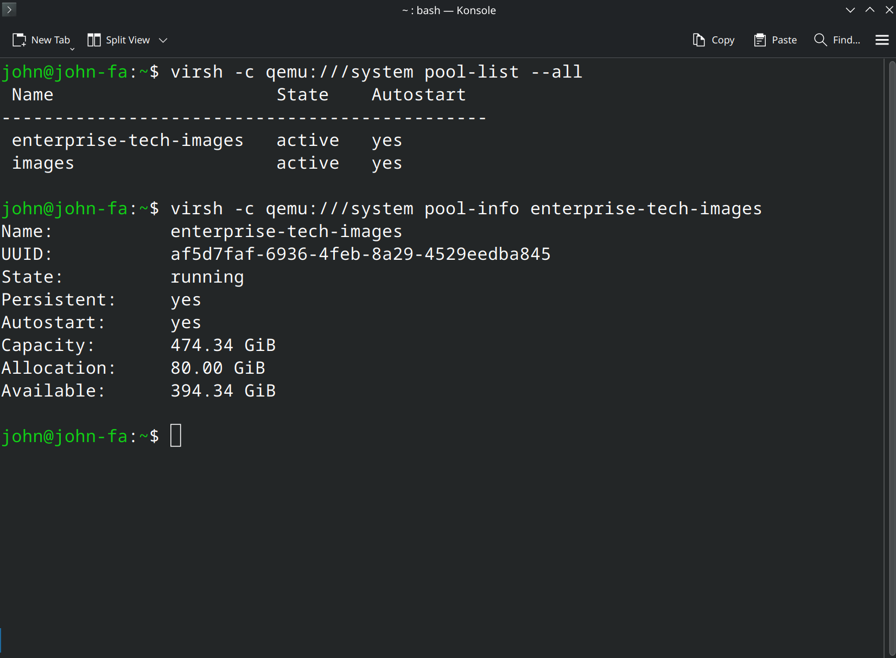
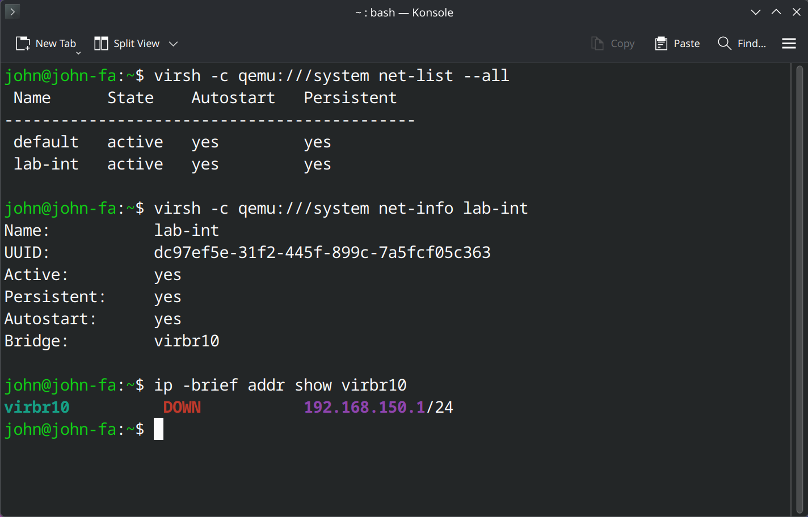

<div align="center">

# 🖥️ EnterpriseTech RHEL 10 Lab

### A production-style Red Hat Enterprise Linux 10.1 homelab built with KVM, QEMU, and libvirt


</div>

---

## 📌 Overview

This repository documents a **multi-VM Red Hat Enterprise Linux 10.1 homelab** designed to simulate a compact enterprise environment and explore real-world Linux systems administration in a structured, repeatable, and well-documented way.

The lab is built around a small set of servers with clearly defined roles and is organized in **phases**, with supporting:

- 📘 runbooks  
- ✅ validation checklists  
- 🧪 troubleshooting notes  
- 📸 screenshots  
- 🗂️ technical notes  

---

## 🏗️ Lab Nodes

This environment is centered around four virtual machines:

| Hostname | Role |
|---|---|
| `srv-admin` | Administration and management node |
| `srv-web` | Web service node |
| `srv-db` | Database service node |
| `srv-storage` | Shared storage and NFS/autofs support node |

---

## 🎯 What This Lab Covers

This homelab focuses on practical work across areas such as:

- 🖥️ system provisioning and baseline configuration  
- 📦 package management and repository usage  
- 👤 identity, SSH, and permissions  
- 💾 storage, filesystems, and mount persistence  
- ⚙️ services, boot behavior, and systemd  
- 🌐 networking, hostname resolution, and firewalld  
- 🔐 SELinux-aware administration  
- 📝 logging, scheduling, and operational validation  
- 🧰 reproducible troubleshooting and recovery workflows  

---

## 🧱 Environment

| Item | Value |
|---|---|
| **Guest platform** | Red Hat Enterprise Linux 10.1 |
| **ISO** | `rhel-10.1-x86_64-dvd.iso` |
| **Host platform** | Fedora Linux 43 (KDE Plasma Desktop Edition) |
| **Virtualization stack** | KVM + QEMU + libvirt + virt-manager |
| **Lab style** | Multi-VM local enterprise lab |
| **Documentation model** | Phase-based, validation-first, screenshot-supported |

---

## 🗺️ Project Structure

```text
enterprise-tech-rhel10-lab/
├── README.md
├── assets/
│   ├── diagrams/
│   └── screenshots/
├── docs/
├── notes/
├── phases/
├── runbooks/
├── scripts/
├── troubleshooting/
└── validation/
```

### 📚 Repository Layout

- **docs/** — General design and lab-level documentation  
- **phases/** — Execution and documentation grouped by phase  
- **runbooks/** — Step-by-step operational procedures  
- **validation/** — Checks and verification steps to confirm expected behavior  
- **troubleshooting/** — Failures, root causes, and recovery workflows  
- **scripts/** — Helper scripts used for validation and administration  
- **assets/** — Images, diagrams, and screenshots  
- **notes/** — Host notes, command notes, and supporting technical references  

---

## 🚀 Progress by Phase
- [x] Phase 00 — Bootstrap and repository setup
- [x] Phase 01 — Virtualization host preparation
- [ ] Phase 02 — RHEL 10.1 guest deployment
- [ ] Phase 03 — Shell, files, and local documentation
- [ ] Phase 04 — Identity, SSH, and permissions
- [ ] Phase 05 — Software and scripting
- [ ] Phase 06 — Running systems and service management
- [ ] Phase 07 — Local storage and filesystems
- [ ] Phase 08 — Networking and firewall
- [ ] Phase 09 — NFS and autofs
- [ ] Phase 10 — SELinux and troubleshooting
- [ ] Phase 11 — Final integrated validation

---

## 🖼️ Phase 01 Snapshot Gallery

### Host identity


### KVM capability


### Storage pool


### Internal lab network


---

## ✅ Current Status
**Status:** In progress  
**Completed phase:** Phase 01 — Virtualization host  
**Next phase:** Phase 02 — RHEL 10.1 guest deployment

---

## 🧠 Design Philosophy
This project is built as a hands-on Linux systems lab with an emphasis on:

* **repeatability**
* **operational clarity**
* **clean documentation**
* **controlled validation**
* **realistic administration workflows**

The goal is not to collect random commands, but to build a lab that behaves like a small, structured enterprise environment.

---

## 🔗 Key Files
* `phases/01-virtualization-host/README.md`
* `phases/01-virtualization-host/lab-int.xml`
* `runbooks/kvm-libvirt-host-setup.md`
* `notes/host-hardware.md`
* `docs/architecture.md`

---

## 🛠️ Notes
* The virtualization host runs Fedora 43 KDE Plasma, while guest systems are planned on RHEL 10.1.
* Screenshots are grouped by phase under `assets/screenshots/`.
* Documentation grows incrementally as each phase is completed.

---

## 👤 Author

**Angel Diez**
