<div align="center">

# 🖥️ EnterpriseTech RHEL 10 Lab

### A production-style Red Hat Enterprise Linux 10.1 homelab built with KVM, QEMU, and libvirt


</div>

---

## 📌 Overview
This repository documents a **multi-VM Red Hat Enterprise Linux 10.1 homelab** designed to simulate a compact enterprise environment. It explores real-world Linux systems administration in a structured, repeatable, and well-documented way.

The lab is organized into **execution phases**, supported by professional runbooks, validation checklists, and technical evidence.

Phase 02 established a validated four-node RHEL 10.1 baseline that will support the next infrastructure and service configuration phases.

Phase 03 established a validated shell, files, and local documentation workspace across all four guests, creating a clean baseline for the next identity, SSH, and permissions phase.

Phase 04 established a validated identity, SSH, and permissions baseline across all four guests, preparing the lab for the next software and scripting phase.

Phase 05 established a validated software inspection and scripting baseline across all four guests, preparing the lab for the next running systems and service management phase.

Phase 06 established a validated running systems and service management baseline across all four guests, preparing the lab for the next local storage and filesystems phase.

---

## 🏗️ Lab Nodes
The infrastructure consists of four core virtual machines:

| Hostname | Role |
| :--- | :--- |
| `srv-admin` | Administration and management node |
| `srv-web` | Web service node |
| `srv-db` | Database service node |
| `srv-storage` | Shared storage and NFS/autofs support node |

---

## 🎯 What This Lab Covers
This homelab focuses on practical, production-ready workflows:
* 🖥️ **Provisioning:** Baseline configuration and reproducible deployments.
* 📦 **Software:** Package management and internal repository usage.
* 👤 **Identity:** SSH hardening, permissions, and user lifecycle.
* 💾 **Storage:** Filesystems, LVM, and mount persistence.
* ⚙️ **Systemd:** Service management and boot behavior.
* 🌐 **Networking:** Hostname resolution and Firewalld policy.
* 🔐 **Security:** SELinux-aware administration.
* 📝 **Ops:** Logging, scheduling, and operational validation.
* 🧰 **Recovery:** Reproducible troubleshooting workflows.

---

## 🧱 Environment Context

| Item | Value |
| :--- | :--- |
| **Guest Platform** | Red Hat Enterprise Linux 10.1 (`rhel10.1`) |
| **Host Platform** | Fedora Linux 43 (KDE Plasma Desktop Edition) |
| **Virtualization** | KVM + QEMU + libvirt + virt-manager |
| **Storage Pool** | `enterprise-tech-images` |
| **Internal Network** | `lab-int` |
| **Lab Style** | Multi-VM local enterprise simulation |
| **ISO Path** | `/var/lib/libvirt/boot/rhel-10.1-x86_64-dvd.iso` |

---

## 🗺️ Project Structure

```text
enterprise-tech-rhel10-lab/
├── README.md               # Main landing page
├── assets/                 # Images, diagrams, and screenshots
├── docs/                   # General design and architecture
├── notes/                  # Host notes and technical references
├── phases/                 # Execution documentation by phase
├── runbooks/               # Step-by-step operational procedures
├── scripts/                # Helper scripts for validation
├── troubleshooting/        # Failure logs and recovery workflows
└── validation/             # Verification steps and checklists
```

---

## 🚀 Progress by Phase

- [x] **Phase 00** — Bootstrap and repository setup ✅
- [x] **Phase 01** — Virtualization host preparation ✅
- [x] **Phase 02** — Four-node RHEL 10.1 guest deployment baseline ✅
- [x] **Phase 03** — Shell, files, and local documentation baseline ✅
- [x] **Phase 04** — Identity, SSH, and permissions baseline ✅
- [x] **Phase 05** — Software and scripting baseline ✅
- [x] **Phase 06** — Running systems and service management baseline ✅
- [ ] **Phase 07** — Local storage and filesystems ⚪
- [ ] **Phase 08** — Networking and firewall ⚪
- [ ] **Phase 09** — NFS and autofs ⚪
- [ ] **Phase 10** — SELinux and troubleshooting ⚪
- [ ] **Phase 11** — Final integrated validation ⚪

---

## 🖼️ Snapshot Gallery

### 🖥️ Host Setup (Phase 01)
**Fedora 43 host identity**
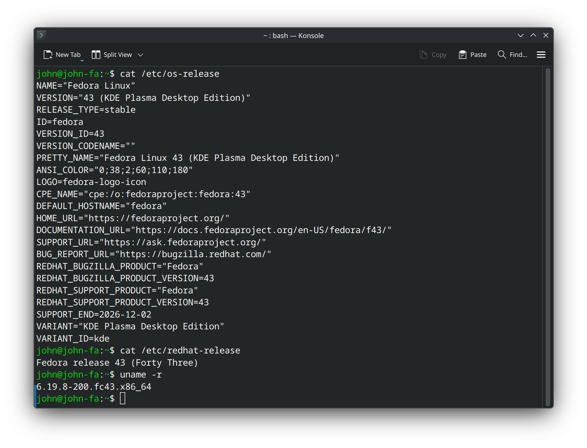

**KVM capability confirmed**
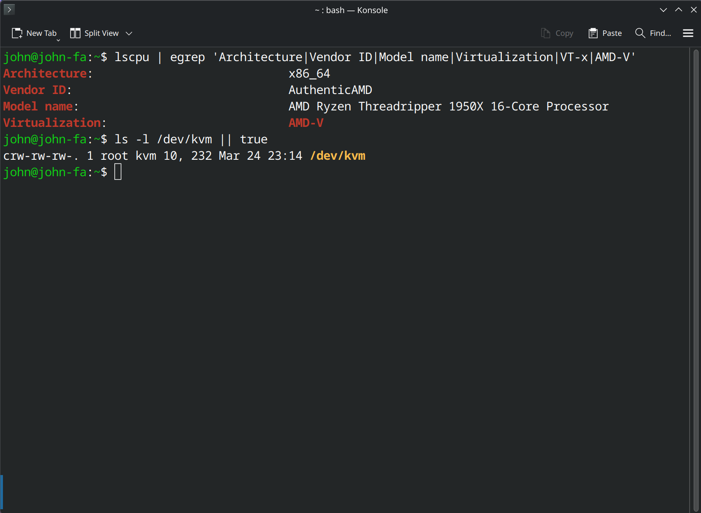

### 🚀 Guest Deployment (Phase 02)
**RHEL 10.1 deployment workflow**


**Final guest validated**
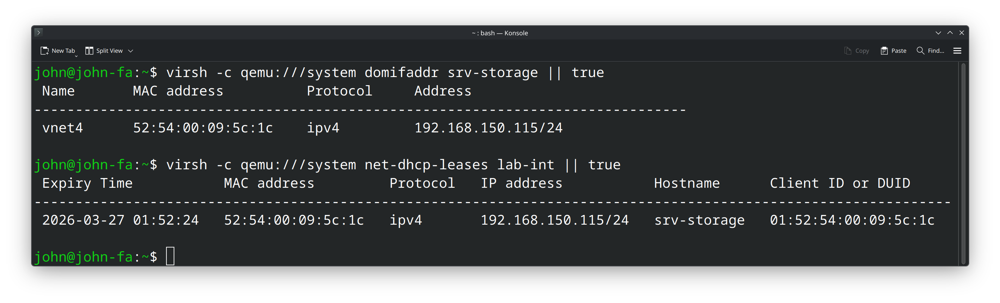

### 🐚 Shell, Files, and Local Documentation (Phase 03)
**srv-admin local documentation and shell workflow**
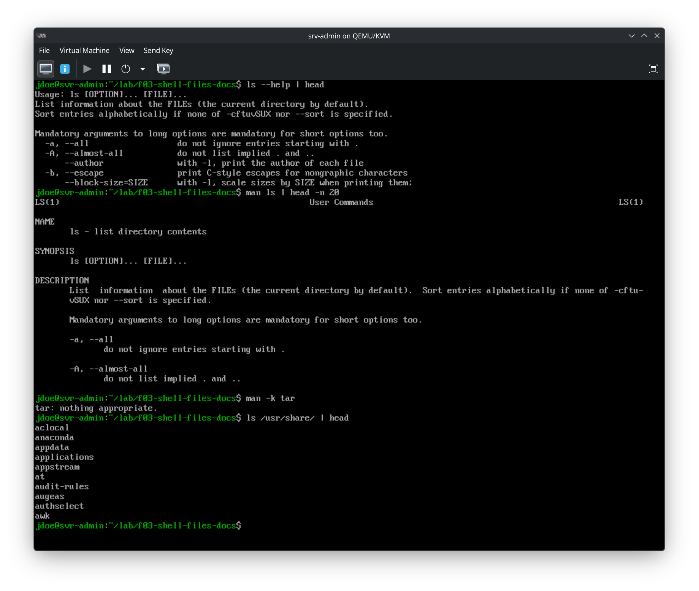

**Replicated workspace validated on secondary guests**
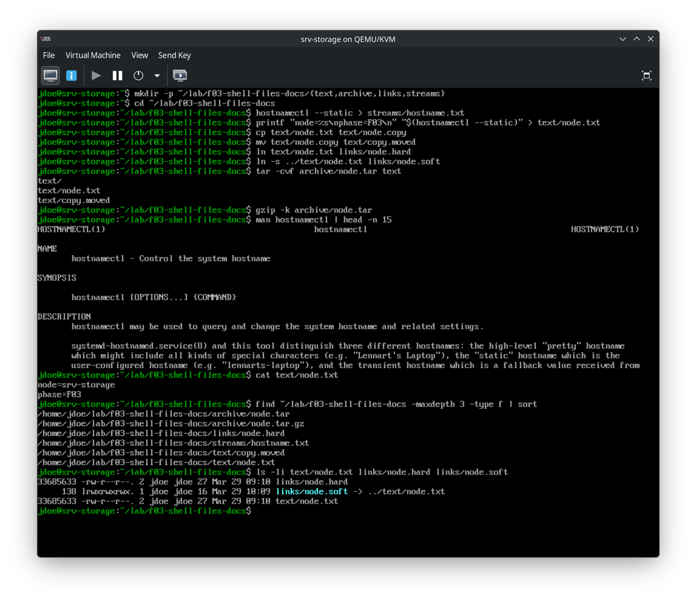

### 🔐 Identity, SSH, and Permissions (Phase 04)
**srv-admin identity and SSH baseline**
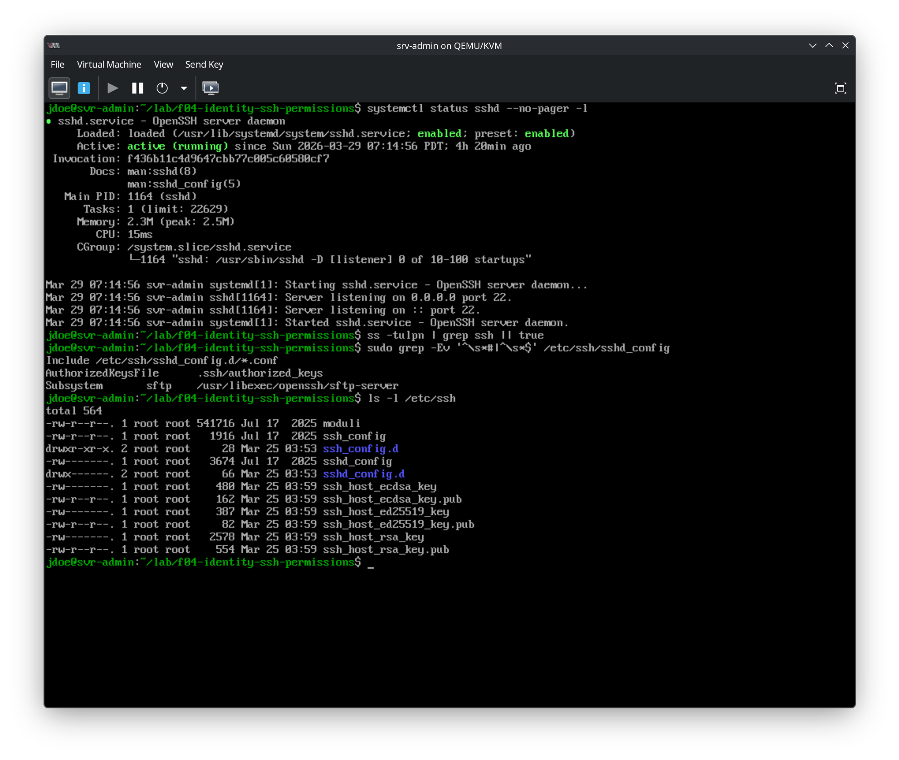

**Replicated permissions workspace validated on secondary guests**
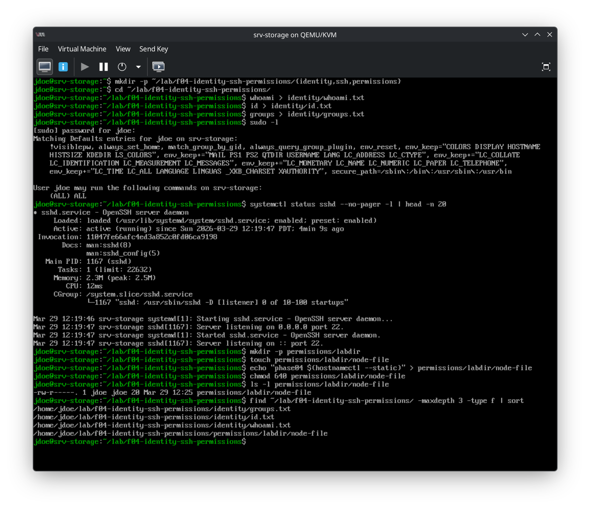

### 📦 Software and Scripting (Phase 05)
**srv-admin software and scripting baseline**
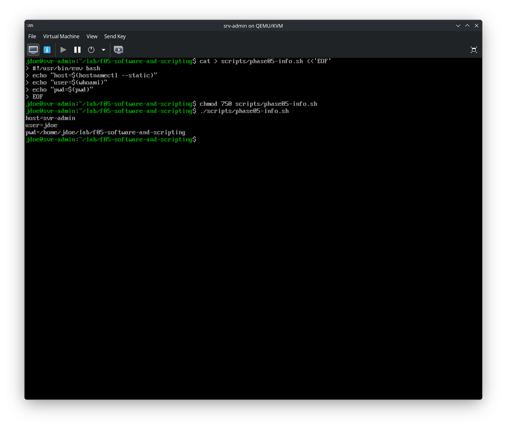

**Replicated software/scripting workspace validated on secondary guests**
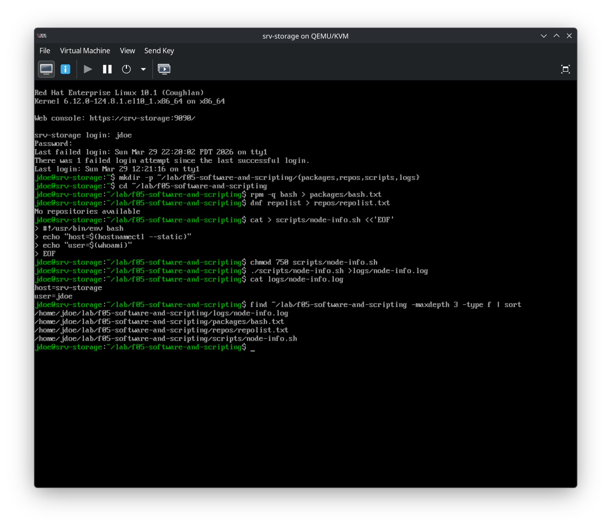

### ⚙️ Running Systems and Service Management (Phase 06)
**srv-admin service management baseline**
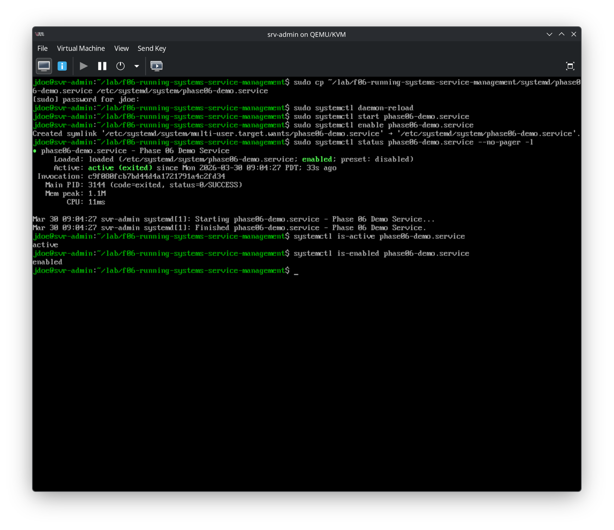

**Replicated service-management workspace validated on secondary guests**
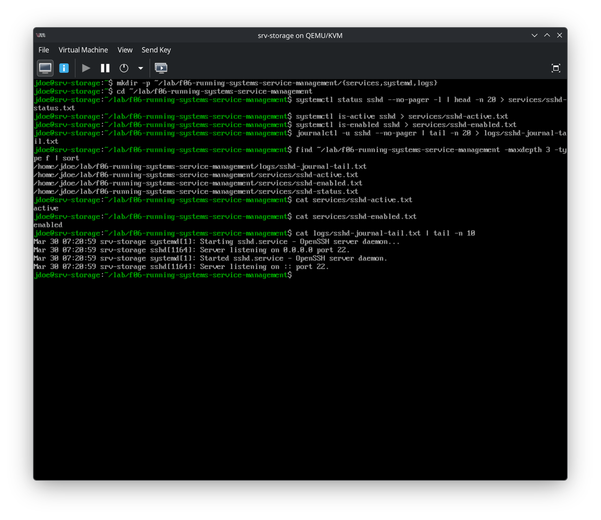

---

## ✅ Active Development

> [!IMPORTANT]
> **Status:** Active Development  
> **Validated Guests:** `srv-admin`, `srv-web`, `srv-db`, `srv-storage`  
> **Current Baseline:** Four-node RHEL 10.1 deployment + Phase 03 baseline + Phase 04 baseline + Phase 05 baseline + Phase 06 service-management baseline complete  
> **Next Milestone:** Phase 07 — Local Storage and Filesystems

---

## 🧪 Current Lab Baseline Summary

Phase 02 produced a validated four-node RHEL 10.1 guest set:
- `srv-admin`, `srv-web`, `srv-db`, `srv-storage`

Phase 03 added a validated shell/files/docs workspace baseline across all four guests:
- shell navigation and working context validation
- stdout and stderr redirection into persistent files
- grep and regex filtering workflows
- file creation, copy, move, and removal
- hard link and symbolic link validation
- tar, gzip, and bzip2 archive handling
- local documentation lookup with `man`, `--help`, and package docs
- post-reboot persistence validated on `srv-admin`

Phase 04 added a validated identity, SSH, and permissions baseline across all four guests:
- local identity inspection and evidence capture
- `sudo` access validation for the working user
- SSH service baseline review and active configuration inspection
- controlled ownership and group ownership testing
- numeric permission validation with `chmod`
- replicated identity and permissions workspace validation on secondary guests

Phase 05 added a validated software and scripting baseline across all four guests:
- installed package inspection with `rpm -q`
- repository state capture with `dnf repolist`
- persistent software evidence stored in workspace files
- Bash script creation with proper shebangs
- executable permission validation with `chmod`
- script output capture into persistent log files
- replicated software/scripting workspace validation on secondary guests

Phase 06 added a validated running systems and service management baseline across all four guests:
- running service inspection with `systemctl list-units --type=service --state=running`
- `sshd` state validation with `status`, `is-active`, and `is-enabled`
- service evidence stored in persistent workspace files
- `journalctl` review for service-specific and boot-level logs
- controlled custom `systemd` service creation and validation on `srv-admin`
- replicated `sshd` service-management workspace validation on `srv-web`, `srv-db`, and `srv-storage`

---

## 🧠 Design Philosophy
This project is built as a hands-on Linux systems lab emphasizing:
* **Repeatability:** Workflows must be easy to replicate.
* **Operational Clarity:** Clear separation between host and guest tasks.
* **Clean Documentation:** Validation-first approach with visual evidence.
* **Realistic Workflows:** Mimicking small, structured enterprise environments.

---

## 🔗 Key Files
* `runbooks/rhel10-install.md` — Main guest installation guide.
* `runbooks/f03-shell-files-docs.md` — Phase 03 operational runbook.
* `runbooks/f04-identity-ssh-permissions.md` — Phase 04 operational runbook.
* `runbooks/f05-software-and-scripting.md` — Phase 05 operational runbook.
* `runbooks/f06-running-systems-service-management.md` — Phase 06 operational runbook.
* `runbooks/kvm-libvirt-host-setup.md` — Phase 01 virtualization host setup and validation.
* `notes/guest-inventory.md` — Current state of all lab VMs.
* `phases/06-running-systems-service-management/README.md` — Detailed Phase 06 running systems and service management report.
* `phases/05-software-and-scripting/README.md` — Detailed Phase 05 software/scripting report.
* `phases/04-identity-ssh-permissions/README.md` — Detailed Phase 04 identity/SSH/permissions report.
* `phases/03-shell-files-docs/README.md` — Detailed Phase 03 shell/files/docs report.
* `phases/02-rhel10-install/README.md` — Detailed Phase 02 deployment report.
* `phases/01-virtualization-host/README.md` — Host preparation and validation record.
* `validation/06-running-systems-service-management-checklist.md` — Phase 06 validation checklist.
* `validation/05-software-and-scripting-checklist.md` — Phase 05 validation checklist.
* `validation/04-identity-ssh-permissions-checklist.md` — Phase 04 validation checklist.
* `validation/03-shell-files-docs-checklist.md` — Phase 03 validation checklist.
* `docs/architecture.md` — High-level lab design.

---

## 👤 Author
**Angel Diez**
