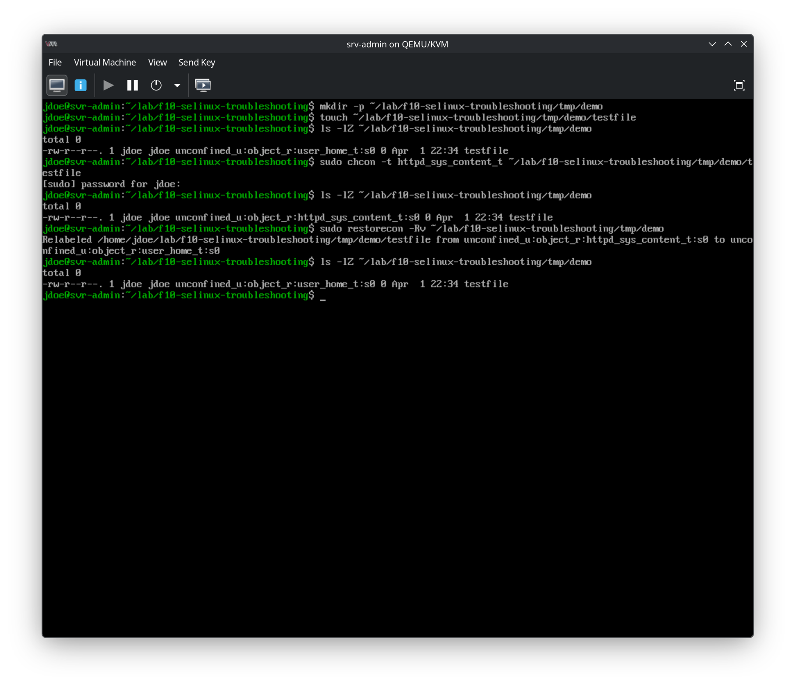
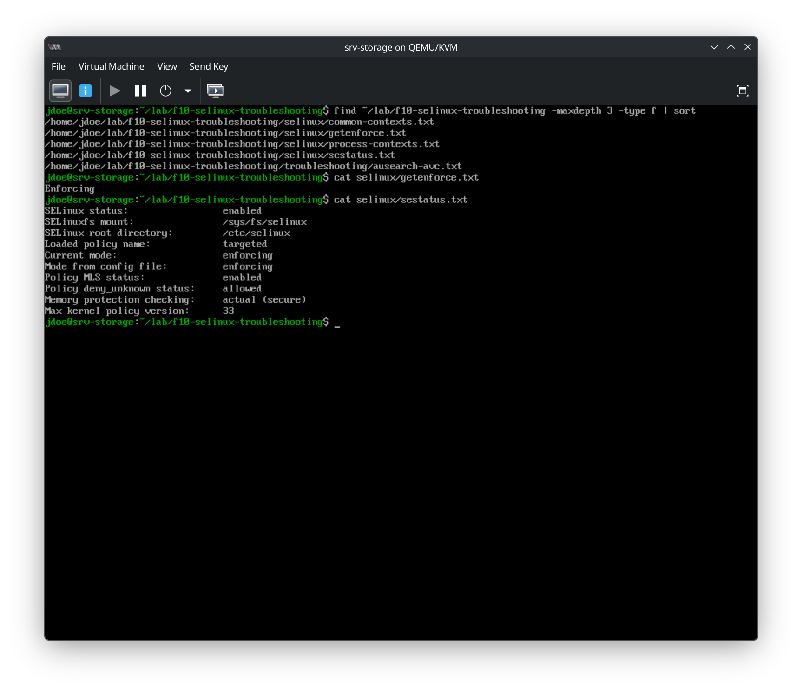
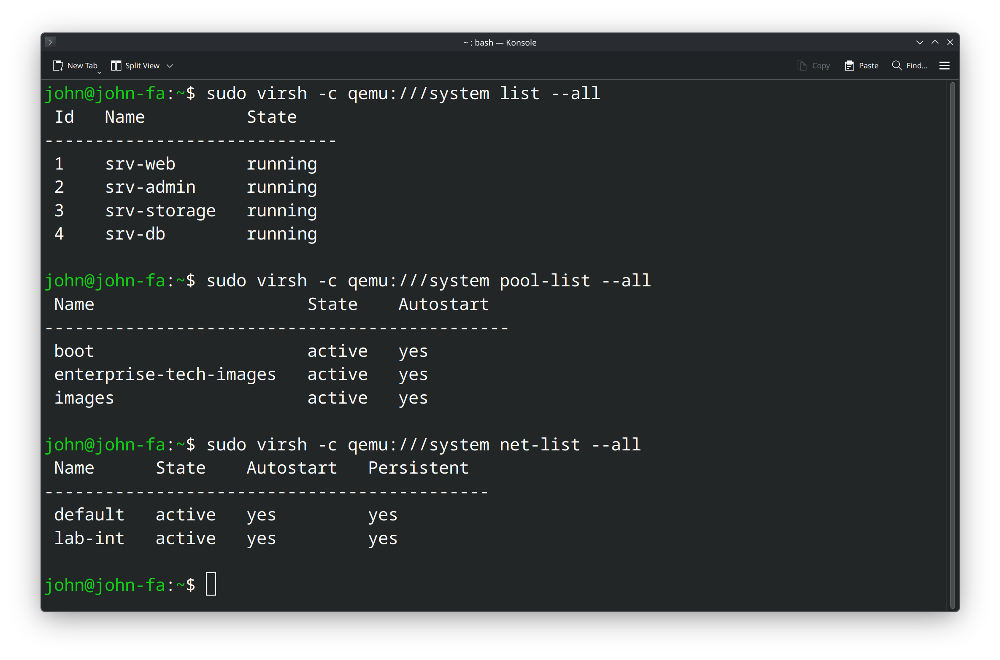
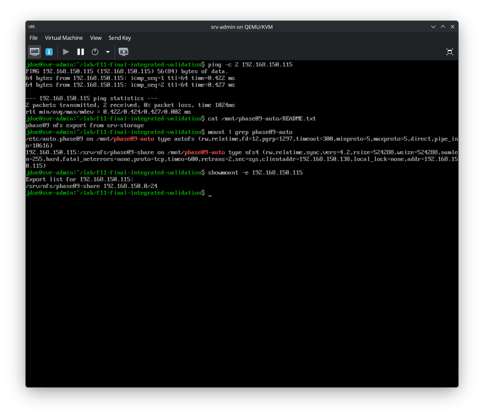

# 🖥️ EnterpriseTech RHEL 10 Lab

### A production-style Red Hat Enterprise Linux 10.1 homelab built with KVM, QEMU, and libvirt

---

## 📌 Overview
This repository documents a **multi-VM Red Hat Enterprise Linux 10.1 homelab** designed to simulate a compact enterprise environment. It explores real-world Linux systems administration in a structured, repeatable, and well-documented way.

The lab is organized into **execution phases**, supported by professional runbooks, validation checklists, and technical evidence.

Phase 02 established a validated four-node RHEL 10.1 baseline.
Phase 03 established a validated shell, files, and local documentation workspace.
Phase 04 established a validated identity, SSH, and permissions baseline.
Phase 05 established a validated software inspection and scripting baseline.
Phase 06 established a validated running systems and service management baseline.
Phase 07 established a validated local storage and filesystem baseline.
Phase 08 established a validated networking and firewall baseline.
Phase 09 established a validated NFS and autofs baseline.
Phase 10 established a validated SELinux and troubleshooting baseline.
Phase 11 established the final integrated validation of the full lab, confirming that guest readiness, storage, NFS/autofs, core services, and SELinux remained healthy together across the environment.

---

## 🏗️ Lab Nodes
The infrastructure consists of four core virtual machines:

| Hostname | Role | Description |
| :--- | :--- | :--- |
| `srv-admin` | **Administration** | Management node and reference for full workflows. |
| `srv-web` | **Web Service** | Application node for web service simulation. |
| `srv-db` | **Database** | Backend node for structured data services. |
| `srv-storage` | **Storage** | Shared storage, NFS server, and automation node. |

---

## 🚀 Progress by Phase

- [x] **Phase 00** — Bootstrap and repository setup ✅
- [x] **Phase 01** — Virtualization host preparation ✅
- [x] **Phase 02** — Four-node RHEL 10.1 guest deployment baseline ✅
- [x] **Phase 03** — Shell, files, and local documentation baseline ✅
- [x] **Phase 04** — Identity, SSH, and permissions baseline ✅
- [x] **Phase 05** — Software and scripting baseline ✅
- [x] **Phase 06** — Running systems and service management baseline ✅
- [x] **Phase 07** — Local storage and filesystems baseline ✅
- [x] **Phase 08** — Networking and firewall baseline ✅
- [x] **Phase 09** — NFS and autofs baseline ✅
- [x] **Phase 10** — SELinux and troubleshooting baseline ✅
- [x] **Phase 11** — Final integrated validation ✅

---

## 🖼️ Snapshot Gallery

### 🖥️ Host & Deployment (Phases 01-02)
**Host Identity & RHEL 10.1 Anaconda Summary**

### ⚙️ Services & Storage (Phases 06-07)
**srv-admin custom services & persistent mounts**

### 🌐 Networking & Firewall (Phase 08)
**srv-admin controlled firewall rule & node replication**

### 📂 NFS and autofs (Phase 09)
**srv-storage NFS server baseline and export validation**

### 🔐 SELinux and Troubleshooting (Phase 10)
**srv-admin SELinux baseline and controlled relabel validation**

### ✅ Final Integrated Validation (Phase 11)
**Host-side libvirt overview and guest inventory**

**Final cross-node integrated validation**

---

## ✅ Project State

> [!IMPORTANT]
> **Status:** Complete ✅  
> **Current Baseline:** RHEL 10.1 Deployment + All Phases through Phase 11 Final Integrated Validation Complete.  
> **Project State:** Final lab validation complete and documentation closed.

---

## 🧪 Current Lab Baseline Summary

**Phase 02-06:** Provisioning, Identity, Software, and Service management baselines.
**Phase 07-08:** Storage partitioning, XFS filesystems, and Firewalld zone management.
**Phase 09:** NFS export management, client-side validation, and `autofs` automation.
**Phase 10:** SELinux enforcement inspection, context visibility, controlled relabeling, and diagnostics.
**Phase 11:** Host-side libvirt validation, integrated guest validation across `srv-admin`, `srv-storage`, `srv-web`, and `srv-db`, persistent storage verification, NFS/autofs acceptance checks, and full-lab confirmation that services and SELinux remained healthy together.

---

## 🔗 Key Files (All Phases)

### 📘 Runbooks
* `runbooks/rhel10-install.md` — Main installation guide.
* `runbooks/f03-shell-files-docs.md` | `runbooks/f04-identity-ssh-permissions.md`
* `runbooks/f05-software-and-scripting.md` | `runbooks/f06-running-systems-service-management.md`
* `runbooks/f07-local-storage-filesystems.md` | `runbooks/f08-networking-firewall.md`
* `runbooks/f09-nfs-autofs.md` | `runbooks/f10-selinux-troubleshooting.md`
* `runbooks/f11-final-integrated-validation.md`

### 📋 Phase Reports
* `phases/01-virtualization-host/README.md` | `phases/02-rhel10-install/README.md`
* `phases/03-shell-files-docs/README.md` | `phases/04-identity-ssh-permissions/README.md`
* `phases/05-software-and-scripting/README.md` | `phases/06-running-systems-service-management/README.md`
* `phases/07-local-storage-filesystems/README.md` | `phases/08-networking-firewall/README.md`
* `phases/09-nfs-autofs/README.md` | `phases/10-selinux-troubleshooting/README.md`
* `phases/11-final-integrated-validation/README.md`

### ✅ Validation Checklists
* `validation/03-shell-files-docs-checklist.md` | `validation/04-identity-ssh-permissions-checklist.md`
* `validation/05-software-and-scripting-checklist.md` | `validation/06-running-systems-service-management-checklist.md`
* `validation/07-local-storage-filesystems-checklist.md` | `validation/08-networking-firewall-checklist.md`
* `validation/09-nfs-autofs-checklist.md` | `validation/10-selinux-troubleshooting-checklist.md`
* `validation/11-final-integrated-validation-checklist.md`

---

## 👤 Author
**Angel Diez**
